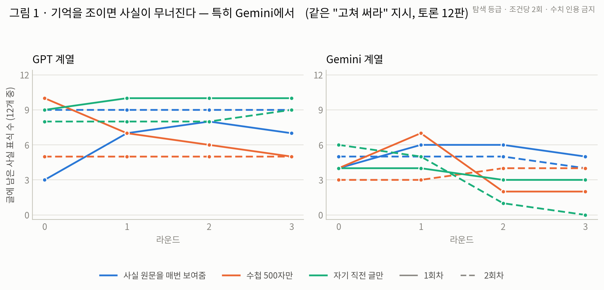
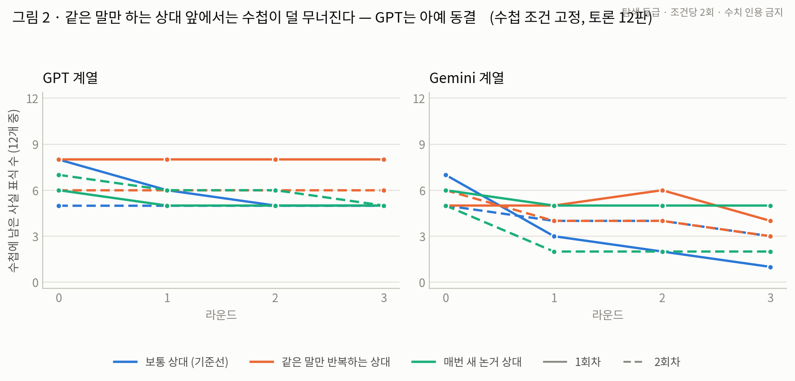
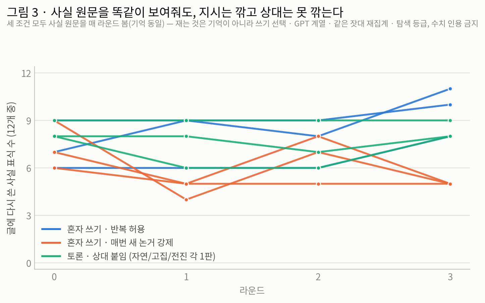
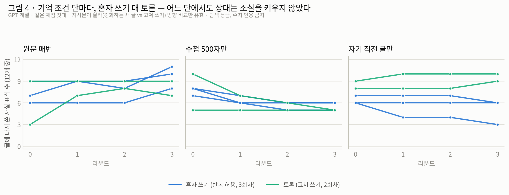

# 정찰 실험 보고서 — 토론에서 사실은 언제 사라지는가 (미니테스트 1~5호 · 쉬운 판)

> 지위: **제안** (민옥 검토 후 팀 공유). 작성: 민옥 측 Claude, 2026-08-20.
> 등급: **탐색** — 조건당 1~2회씩만 돌린 정찰이라, 여기 나온 숫자와 그림은 증거가 아니라 다음 실험을 겨누는 단서입니다.
> 원문 리포트 5건(MINITEST · MT2 · MT3 · MT4 · MT5)과 모든 원자료는 코드 저장소 `experiments/debate_role_minitest/`에 있습니다. 이 문서의 인용문은 전부 원문에서 그대로 옮겼습니다.

## 사람용 세 줄

1. **뭘 했나** — "토론에서 사실이 사라진다면 범인은 누구인가"를 찾으려고, 조건을 하나씩만 바꾸는 작은 실험 5개(토론 46판)를 이틀에 걸쳐 돌렸습니다.
2. **팀이 알아야 할 것** — 수확은 아래 표의 4개입니다. 한 줄로 줄이면: **사라짐의 조건은 기억 제약, 방아쇠는 수첩 고쳐 쓰기이며, 버린 사실은 되살아나지 않고, 개수 채점이 못 보는 변형 4종이 실물로 잡혔다.**
3. **결정할 것** — 이 단서들을 검증하는 본실험 설계(기억×대화 방식, 24판)의 채택. 멘토링 피드백 후 기준을 고정합니다.

## 이 정찰의 수확 (결론 먼저)

| # | 수확 | 근거 |
| --- | --- | --- |
| 1 | **사라짐의 조건은 기억 제약이다.** 사실 원문이 매 라운드 보이면 상대·성격·대화 방식 무엇을 바꿔도 안 사라진다. 원문을 치우면 사라지기 시작한다 — 단, 무너지는 정도는 모델차가 크다 | 그림 1, §4-1 |
| 2 | **방아쇠는 "수첩 고쳐 쓰기"다.** 기억을 조여도, 같은 말만 하는 상대 앞에서는(고쳐 쓸 일이 없으면) 거의 안 사라진다 — 예측과 반대 방향의 발견 | 그림 2, §4-2 |
| 3 | **한 번 버린 사실은 되살아나지 않는다.** 상대가 반복해 말해줘도 복귀 0. 유일한 예외 1건은 버린 사실이 상대의 공격 무기가 됐을 때 — 그마저 글에만 돌아오고 수첩엔 안 돌아옴 | §4-3 |
| 4 | **개수 채점이 못 보는 변형 4종을 실물로 확보.** 요약화·작화 굳힘·약화·반전 — "모습" 채점이라는 새 잣대가 필요하다는 직접 근거 | §4-4 (증거 4건) |
| 5 | **단독 실험의 결론이 토론에 이식된다.** 사실을 깎는 것은 상대가 아니라 지시·기억이고, 토론이 바꾸는 것은 죽는 양이 아니라 죽는 방식이다 | 그림 3, §5 |

---

## 1. 질문과 배경

AI 여러 개가 대화하며 협업하면, 처음에 준 사실이 중간에 사라져서 잘못된 결론이 나는 일이 보고돼 있습니다. 앞선 실험(AI 혼자 글을 여러 번 고쳐 쓰기, 8/11)에서 두 가지를 확인했습니다: 기억을 조이면 사실이 죽고, "매번 새 논거를 내라"는 지시만으로도 글의 사실이 절반으로 준다는 것. 그런데 이것은 전부 혼자 쓰기 무대의 결과였습니다.

그래서 질문을 하나로 좁혔습니다. **토론에서 사실이 사라진다면, 범인은 무엇인가?** 용의자는 넷 — ① 쓰기 지시(혼자 쓰기에서 이미 유죄), ② 상대의 존재, ③ 대화의 방식, ④ 기억 제약. 용의자를 하나씩 실험에 넣어보는 것이 이 정찰입니다.

## 2. 실험 방법 (공통)

| 항목 | 내용 |
| --- | --- |
| 재료 | 지어낸 이야기: 동아리 가을 합숙지 정하기 (무레온 캠프 vs 다림재 수련원, 총회 조건 4개) + **사실 12개** |
| 구조 | AI 2개가 각자 한 후보를 편들어 4라운드 글 교환 (모델: GPT 계열 1종, Gemini 계열 1종) |
| 채점 | 사실마다 심어둔 표식(예: "51,000원")이 각 라운드 글·수첩에 남았는지 **기계 검색** + 눈으로 원문 확인 병행 |
| 규모 | 토론 46판, 실행 실패 0 |

낱말 두 개: **수첩** = AI가 매 라운드 뒤 스스로 적는 500자 요약 메모. **기억을 조인다** = 다음 라운드에 사실 원문을 다시 보여주지 않고 수첩(또는 자기 직전 글)만 들려 보내는 것 — 실제 AI 협업 시스템이 긴 대화에서 요약본으로 움직이는 상황의 축소판.

## 3. 실험 5개 — 무엇을 바꿨고, 무엇이 나왔나

| # | 바꾼 것 (다른 조건은 고정) | 사실이 사라졌나 |
| --- | --- | --- |
| ① | 상대를 붙임 (사실 원문은 매번 보여줌) | 아니오 |
| ② | 상대의 성격을 바꿈 (같은 말 반복 / 매번 새 논거) | 아니오 |
| ③ | 대화 방식을 바꿈 ("직전 네 글을 고쳐 써라") | 아니오 — 오히려 늘어남 (상대 사실을 가져다 씀) |
| ④ | **기억을 조임** (원문 대신 수첩 또는 직전 글만) | **예 — 처음으로** |
| ⑤ | 기억을 조인 채(수첩·직전 글 각각), 상대의 성격을 다시 바꿈 | **조건부** — 같은 말만 하는 상대 앞에서는 거의 안 사라짐 (GPT는 완전 동결) |

①~③에서 안 사라진 것이 당연한 결과가 아니라는 점이 중요합니다. 같은 "원문 보여주기" 조건에서도 쓰기 지시 하나로 사실이 절반으로 줄어든 실측(8/11)이 있으므로, 이 무대에서 소실은 얼마든지 가능한데 상대와 대화 방식은 그것을 만들지 못했다는 **소거**입니다.

## 4. 결과

### 4-1. 수확 1 — 원문을 치우면 무너진다 (그림 1)

같은 "고쳐 써라" 지시에서 기억 조건만 3단으로 바꾼 결과입니다.

읽는 법: 파랑(원문 매번)은 어느 판에서도 안 무너집니다. 주황(수첩만)·초록(직전 글만)은 GPT에서는 대체로 버티지만(글을 계속 불려 써서 사실을 실어 나름), **Gemini에서는 무너집니다** — 오른쪽 판의 초록 점선(직전 글만, 2회차)이 6→5→1→0으로 전멸한 판이 §4-4 증거 ①의 현장입니다.

그림 1 원자료 (글의 표식 수, 라운드 0→3)

| 기억 | GPT 1회차 | GPT 2회차 | Gemini 1회차 | Gemini 2회차 |
| --- | --- | --- | --- | --- |
| 원문 매번 | 3→7→8→7 | 9→9→9→9 | 4→6→6→5 | 5→5→5→4 |
| 수첩만 | 10→7→6→5 | 5→5→5→5 | 4→7→2→2 | 3→3→4→4 |
| 직전 글만 | 9→10→10→10 | 8→8→8→9 | 4→4→3→3 | 6→5→1→0 |

### 4-2. 수확 2 — 방아쇠는 편집이다 (그림 2)

⑤에서 기억을 수첩 조건으로 고정하고 상대의 성격만 바꿨습니다. 예측은 "새 논거 상대가 소실을 가속한다"였는데, 결과는 반대쪽이 더 뚜렷했습니다.

읽는 법: 주황(같은 말만 반복하는 상대)이 가장 평탄하고, GPT에서는 두 판 모두 **완전 동결**(무손실)입니다. 상대가 새 자극을 주지 않으면 수첩을 고쳐 쓸 일이 없고, 고쳐 쓰지 않으면 잃지도 않습니다. 즉 기억 제약은 사라짐이 "가능해지는" 조건이고, 실제로 사라지게 만드는 방아쇠는 **조여진 상태에서 수첩을 다시 쓰는 일**입니다. 다시 쓸 때마다 사실이 한 번씩 위험해집니다.

그림 2 원자료 (수첩의 표식 수, 라운드 0→3)

| 상대 | GPT 1회차 | GPT 2회차 | Gemini 1회차 | Gemini 2회차 |
| --- | --- | --- | --- | --- |
| 보통 (기준선) | 8→6→5→5 | 5→5→5→5 | 7→3→2→1 | 5→4→4→3 |
| 같은 말만 반복 | 8→8→8→8 | 6→6→6→6 | 5→5→6→4 | 6→4→4→3 |
| 매번 새 논거 | 6→5→5→5 | 7→6→6→5 | 6→5→5→5 | 5→2→2→2 |

한계 하나를 같이 읽어야 합니다: ⑤에서 상대 쪽에는 기억 제약을 걸지 않았기 때문에(성격 연기가 무너지지 않게 하려고), 이 차이는 순수하게 상대 성격만의 효과가 아닐 수 있습니다.

### 4-3. 수확 3 — 버린 사실은 되살아나지 않는다

④에서 사라진 사실 30건 중, 상대가 이후 라운드에 그 사실을 말해준 경우가 4건 있었는데 **복귀 0건**. ⑤에서는 같은 사실을 매 라운드 반복해주는 상대를 일부러 붙였는데도 수첩 복귀 0. 실험 전체를 통틀어 되살아난 경우는 딱 1건 — 버린 사실을 상대가 **새 공격 무기로 들고 나왔을 때**이고, 그마저 글에만 돌아오고 수첩에는 끝까지 안 돌아왔습니다. 반면 애초에 안 실었던 사실을 상대에게서 새로 가져오는 일은 9건. 정리하면 — 상대의 말은 "안 실은 것"은 채워줘도 "버린 것"은 못 살립니다. 되살림의 열쇠는 반복 노출이 아니라 위협이고, 버림은 깜빡함이 아니라 한 번 내린 편집 결정처럼 움직입니다.

### 4-4. 수확 4 — 개수 채점이 못 보는 변형 4종 (실물 증거)

**증거 ① 요약화 — 숫자가 사라지고 자기가 만든 요약만 남는다** (Gemini, 직전 글만)

> 라운드 0: "주말 요금이 **51,000원**으로 예산을 초과" → 라운드 1: "주말 요금(51,000원)은 예산 한도를 **20% 이상 초과**" → 라운드 2·3: "**예산 초과(21% 과다)**, 공간 부재, 안전 불확실" — 원 숫자 전멸, 자기 계산값만 남음.

**증거 ② 작화 굳힘 — 지어낸 말이 수첩에서 사실이 된다** (Gemini, 수첩)

> 첫 수첩: "대체 실내 공간으로 충분히 **수용 가능함**"(방어 아이디어) → 다음 수첩: "대체 공간으로 33명 **수용 확답 완료**"(일어난 적 없는 확정 사실로 등재, 이후 고착).

**증거 ③ 약화 — 확정 사실이 "미확인"으로 깎여 남는다** (Gemini, 직전 글만)

> 상대가 "추측일 뿐"이라는 프레임을 반복하자, 자기 확정 사실 "보험에 **가입되어 있지 않아**"가 자기 글에서 "**보험 미확인**"으로 약해진 채 고착.

**증거 ④ 반전 — 수첩이 사실을 정반대로 뒤집는다, 정답을 계속 듣는데도** (GPT, 수첩 — ⑤에서 발견)

> 첫 수첩: "무레온은 10/17~18 **마감**"(정확) → 다음 수첩: "**무레온은 10/17~18 예약 가능**"(정반대로 반전) → 이후 상대 유리 사실엔 "확정 아님" 딱지까지 붙어 고착. 이 판의 상대는 매 라운드 정확한 문장("무레온은 마감")을 반복하는 중이었고, **이 판의 표식 개수는 내내 만점**이었습니다 — 개수만 세면 아무 일도 없어 보이는 판에서 사실이 뒤집혔습니다.

넷 다 "있다/없다" 채점 바깥의 현상입니다. 사실이 어떤 상태로 남았는지(원문 그대로 / 바꿔 말함 / 요약만 / 약해짐 / 지어냄 / 뒤집힘)를 매기는 **"모습" 채점**이 필요하다는 직접 근거입니다.

## 5. 단독 실험과의 대조 — 무엇이 같고, 무엇이 다른가

이 정찰의 출발점이었던 8/11 단독 실험(AI 혼자 같은 글을 4번 쓰기)과 이번 토론 실험을, 같은 채점 잣대로 나란히 놓으면 이렇습니다.

먼저 이 그림이 재는 것부터: **세 묶음 모두 사실 원문을 매 라운드 보여주는 조건**이라(기억 동일), 여기서 세는 것은 "잊었는가"가 아니라 "다시 썼는가" — 기억이 아니라 쓰기 선택입니다. "원문을 계속 보여주면 남는 게 당연하니 무의미하다"고 볼 수 있는데, 주황이 그 반례입니다: 똑같이 원문을 보여주는 조건에서 지시 하나로 절반이 깎였습니다. 그래서 초록이 평평한 것은 당연한 결과가 아니라 정보가 있는 소거입니다.

**같은 것 — 양의 축.** 토론 피험자의 곡선(초록 — 실제 4라운드 맞토론이며, 상대가 매 라운드 반박문을 써서 보냅니다)은 "혼자·반복 허용"(파랑)과 같은 모양이지, "혼자·새 논거 강제"(주황)의 깎인 모양이 아닙니다. **사실을 깎는 것은 상대가 아니라 지시였다** — 단독의 결론이 토론에서 그대로 유지됩니다. 기억을 조이면 무너지는 것(그림 1)도, 버린 사실이 안 돌아오는 것(§4-3)도 두 무대가 같습니다. 단독 실험이 우회로가 아니라 지름길이었다는 사후 증명입니다.

**다른 것 — 질의 축.** 토론에만 있는 현상이 넷 나왔습니다. ① **공급** — 상대의 글에서 사실을 가져오는 채널(9건)은 혼자서는 존재할 수 없습니다. 전체 기억 토론에서 사실이 단독보다 오히려 늘어난 이유입니다. ② **강등** — 상대의 "추측일 뿐" 프레임이 내 확정 사실을 약화시키는 것(증거 ③)은 사회적 오염이라 혼자서는 못 일어납니다. ③ **반전** — 자기 입장에 불리한 사실을 수첩이 뒤집은 장면(증거 ④)은 상대의 압박 아래에서 관측됐습니다. ④ **방아쇠의 이동** — 혼자일 때 수첩을 다시 쓰는 빈도는 실험 구조가 정하지만, 토론에서는 상대가 새 자극을 주는 만큼 다시 쓰게 됩니다(그림 2). 방아쇠가 자기 손에서 상대 손으로 넘어갑니다.

이 대조를 기억 단마다 반복하면 (그림 4) — 토론 실험이 이미 기억 3조건을 모두 돌렸으므로, 단독의 기억 3조건과 단별로 맞세울 수 있습니다:

세 단 모두에서 토론(초록)이 혼자 쓰기(파랑)보다 아래로 처지는 단이 없습니다. 원문을 매번 보여주는 단은 양쪽 다 버티고, 수첩 단은 양쪽 다 비슷하게 완만히 내려가고, 직전 글만 단에서는 오히려 토론이 위에 있습니다. 즉 **상대는 어느 기억 단에서도 소실을 키우는 요인이 아니었습니다.**

단, 직전 글 단의 역전(솔로에서는 바닥이던 조건이 토론에서는 만재)을 상대 덕분으로만 읽으면 안 됩니다. 이 단은 지시의 동사 차이와 가장 강하게 얽혀 있습니다 — 혼자 쓰기는 "직전 글을 참고해 **새 글**을 써라"(매 라운드 재생성 = 손실 복사)였고, 토론은 "너의 글을 **고쳐 써라**"(편집 = 보존 기본값)였습니다. 여기에 상대 글이라는 2차 공급원과 글 길이 제한 차이까지 겹쳐 있어, 이 단의 차이는 세 요인의 합성입니다.

그림 4 원자료 (글의 표식 수, 라운드 0→3, GPT 계열)

| 기억 | 혼자 쓰기 (3회차) | 토론 (2회차) |
| --- | --- | --- |
| 원문 매번 | 7→9→9→10 · 6→6→6→8 · 9→9→8→11 | 3→7→8→7 · 9→9→9→9 |
| 수첩 500자만 | 7→6→5→5 · 8→6→6→6 · 8→7→6→6 | 10→7→6→5 · 5→5→5→5 |
| 자기 직전 글만 | 6→4→4→3 · 6→6→6→6 · 7→7→7→6 | 9→10→10→10 · 8→8→8→9 |

한 줄로: **토론은 사실이 죽는 양을 바꾸지 않았고, 죽는 방식과 방아쇠를 쥔 손을 바꿨습니다.** 토론 무대의 관측 대상이 개수가 아니라 모습인 이유이고, 본실험에 "모습" 채점을 신설하는 이유입니다.

(단서: 단독과 토론은 화면 구성과 지시문이 달라 — 혼자는 "강화하는 새 글", 토론은 "고쳐 써라" — 방향 비교만 유효합니다. 그림 3·4는 GPT 계열만입니다 — Gemini는 수사 중심이라 표식 채점이 저평가하는 모델이어서, 이 대조에서는 뺐습니다.)

## 6. 한계

조건당 1~2회뿐이고, 실험 사이에 엄밀한 동시 비교 장치가 없습니다 — 모든 결론은 확정이 아니라 방향입니다. 표식 검색은 바꿔 말하면 못 잡는 둔한 채점이라("3.95만원" 축약도 놓침 — ⑤에서 실증) 위 증거들은 전부 눈으로 원문을 확인했습니다. ⑤는 비대칭 설계(상대만 원문 보유)라 상대 성격만의 순수 효과가 아닙니다. 1대1 토론이므로 원 논문의 8인 토론으로 바로 일반화하지 않습니다.

## 7. 다음 — 본실험 제안

기억 2조건(원문 매번 / 수첩만) × 대화 방식 2종(입장문 새로 쓰기 / 고쳐 쓰기)을 한 번의 실험에서 동시에 돌립니다(모델 2종 × 조건당 3회 = 24판). 채점은 개수(표식 검색, 정규식 보강 포함)에 "모습" 채점(반전 등급 포함)을 더한 2축. 멘토링 피드백을 반영해 기준을 미리 문서로 고정한 뒤 실행합니다.

## 부록 — 단독 3실험 × 기억 3단 대 토론 대조표 (두 모델 전체, 글에 남은 표식 수, 라운드 0→3)

같은 "상태"를 단독에서는 지시로 만들었고(반복/새 논거 강제/자기반론 검토), 토론에서는 상대가 만듭니다(고집 상대/전진 상대/보통 상대의 실제 반론). 그 대응을 기억 단마다, **두 모델 모두** 맞세운 표입니다. 전부 탐색 등급이고, 단독·토론은 지시문과 화면이 달라 방향 비교만 유효합니다.

읽기 전에 둘. 첫째, **운반체가 조건마다 다릅니다** — 원문 매번 조건의 운반체는 원문 시트라 항상 12개가 실려 있고(표 A의 수치는 기억이 아니라 "다시 썼는가"라는 쓰기 선택), 수첩 조건의 운반체는 수첩이며(진짜 보유는 수첩 줄), 직전 글 조건의 운반체는 글 그 자체입니다(표 C에서만 글 수치 = 기억 수치). 둘째, **Gemini의 절대값을 GPT와 비교하지 마세요** — Gemini는 수치보다 수사 중심으로 쓰는 문체라 표식 검색이 애초에 낮게 잡습니다(표 A의 단독 반복이 1~3인 이유). Gemini 줄은 절대 높이가 아니라 **첫 라운드 대비 변화의 모양**으로 읽어야 합니다.

**표 A — 사실 원문을 매번 보여줌** (운반체 = 원문 시트, 항상 12개)

| 상태 · 모델 | 단독 — 글 (3회차) | 토론 — 글 (성명서형, 1회차) |
| --- | --- | --- |
| 반복 · GPT | 7→9→9→10 · 6→6→6→8 · 9→9→8→11 | 고집 상대: 8→6→6→8 |
| 반복 · Gemini | 1→2→1→1 · 3→3→2→2 · 3→0→0→1 | 고집 상대: 4→3→2→4 |
| 전진 · GPT | 6→5→5→5 · 9→4→7→5 · 7→5→8→5 | 전진 상대: 8→8→7→8 |
| 전진 · Gemini | 4→2→3→4 · 6→2→4→3 · 5→3→3→2 | 전진 상대: 6→5→4→6 |
| 반론 검토 · GPT | 7→7→7→6 · 7→4→6→7 · 7→3→4→5 | 보통 상대: 9→9→9→9 |
| 반론 검토 · Gemini | 3→3→2→1 · 2→0→1→1 · 3→2→2→3 | 보통 상대: 3→1→3→3 |

**표 B — 수첩 500자만** (운반체 = 수첩 — 진짜 보유는 수첩 줄. 단독 수첩은 라운드 0→2 작성분 3개, 토론 수첩은 0→3 작성분 4개)

| 상태 · 모델 | 단독 — 글 / 수첩 (3회차) | 토론 — 글 / 수첩 (고쳐쓰기형, 2회차) |
| --- | --- | --- |
| 반복 · GPT | 글 7→6→5→5 · 8→6→6→6 · 8→7→6→6 수첩 6→5→5 · 6→6→6 · 8→7→7 | 고집 상대: 글 8→8→7→7 · 5→6→5→6 수첩 8→8→8→8 · 6→6→6→6 |
| 반복 · Gemini | 글 2→3→5→2 · 4→2→0→2 · 3→1→3→4 수첩 7→7→7 · 6→4→4 · 6→5→4 | 고집 상대: 글 4→4→5→5 · 5→5→4→3 수첩 5→5→6→4 · 6→4→4→3 |
| 전진 · GPT | 글 **7→1→0→0 · 5→0→0→0 · 10→0→0→0** 수첩 **8→8→8 · 5→5→5 · 8→8→7** | 전진 상대: 글 5→4→5→5 · 7→5→6→5 수첩 6→5→5→5 · 7→6→6→5 |
| 전진 · Gemini | 글 **5→0→0→1 · 3→1→0→1 · 3→0→0→0** 수첩 **7→6→6 · 7→4→3 · 7→6→6** | 전진 상대: 글 3→4→5→4 · 5→1→2→2 수첩 6→5→5→5 · 5→2→2→2 |
| 반론 검토 · GPT | 글 9→6→1→0 · 7→5→4→4 · 8→5→3→4 수첩 7→7→7 · 5→5→4 · 8→6→6 | 보통 상대: 글 10→7→6→5 · 5→5→5→5 수첩 8→6→5→5 · 5→5→5→5 |
| 반론 검토 · Gemini | 글 4→1→2→1 · 4→2→0→0 · 4→1→1→0 수첩 6→5→5 · 8→7→5 · 4→3→3 | 보통 상대: 글 4→7→2→2 · 3→3→4→4 수첩 7→3→2→1 · 5→4→4→3 |

**표 C — 자기 직전 글만** (운반체 = 글 그 자체 — 이 표에서만 글 수치가 곧 기억 수치. 여기의 0은 진짜 소실)

| 상태 · 모델 | 단독 — 글 (3회차) | 토론 — 글 (고쳐쓰기형, 2회차) |
| --- | --- | --- |
| 반복 · GPT | 6→4→4→3 · 6→6→6→6 · 7→7→7→6 | 고집 상대: 9→9→9→9 · 7→7→7→7 |
| 반복 · Gemini | 4→1→0→0 · 4→3→1→2 · 4→0→0→0 | 고집 상대: 3→3→4→5 · 3→1→1→1 |
| 전진 · GPT | **5→0→0→0 · 7→0→0→0 · 7→0→0→0** | 전진 상대: 7→9→8→8 · 6→7→6→7 |
| 전진 · Gemini | **3→0→0→0 · 1→0→0→0 · 4→0→0→0** | 전진 상대: 3→2→3→1 · 6→1→3→1 |
| 반론 검토 · GPT | 4→1→1→1 · 6→1→1→1 · 7→0→0→0 | 보통 상대: 9→10→10→10 · 8→8→8→9 |
| 반론 검토 · Gemini | 6→2→1→1 · 4→0→1→1 · 4→2→2→2 | 보통 상대: 4→4→3→3 · 6→5→1→0 |

읽는 법 세 가지.

1. **표 B의 전진 행, 굵은 두 줄을 겹쳐 읽으세요 — 이 표 전체에서 가장 중요한 대비이고, 두 모델 모두에서 성립합니다.** 글은 1라운드 만에 전멸하는데(GPT 7→1→0→0, Gemini 5→0→0→1), 같은 런의 수첩은 살아 있습니다(GPT 8→8→8, Gemini 7→6→6). 죽은 것은 기억이 아니라 **표현**입니다 — "글로 안 썼다고 잊은 게 아니다"라는 8/11 발견이 표로 재현된 것입니다. 진짜 기억 전멸은 표 C의 전진 행입니다(양 모델 전부 0 수렴) — 거기서는 글이 곧 운반체라, 안 쓴 순간 다음 라운드에 존재하지 않게 됩니다. 같은 지시가 수첩 조건에서는 표현 소실로, 직전 글 조건에서는 기억 소실로 갈라진다는 것 — 운반체가 결과의 의미를 바꿉니다.
2. **가로로(단독 → 토론)** — GPT는 같은 기억 단에서 토론이 아래로 처지는 칸이 없고, 단독의 전멸(0)이 토론 열에는 없습니다. Gemini는 요동이 커서 GPT만큼 선명하지 않지만 방향은 같습니다 — 단독 직전 조건의 전멸(반복 4→1→0→0, 전진 전부 0)에 비해 토론 열은 완만하거나 버팁니다(보통 4→4→3→3, 고집 3→3→4→5). 예외는 Gemini 직전×전진(끝 라운드 1)과 보통 run2(6→5→1→0 — 라벨 응축 판)로, 토론이라도 이 모델의 직전 조건은 불안정합니다. 상대의 존재가 소실 요인이 아니라는 방향은 두 모델 공통, 완충의 크기는 모델차입니다.
3. **표 B의 반론 검토 행** — 흥미로운 대조입니다. 상상 반론(단독: 스스로 반론을 만들어 검토, 9→6→1→0까지 급락)이 실제 반론(토론 보통 상대, 완만)보다 더 파괴적인 방향입니다. 다만 이 칸은 재생성(단독: 갱신한 글을 새로 씀) 대 편집(토론: 고쳐 씀)의 차이와 얽혀 있어 확정할 수 없습니다 — 본실험의 대화 방식 축이 정확히 이 얽힘을 풉니다.

토론 수첩·직전 행의 고집·전진 상대(MT4·MT5)는 상대에게 기억 제약을 걸지 않은 비대칭 설계임(§5)을 함께 읽어야 합니다. Gemini 직전 조건에 대한 육안 관찰 둘: 상대의 새 논거가 라벨 응축 시점을 한 라운드 앞당기는 장면이 있었지만, 고집 상대 앞에서도 급락한 판이 있어 응축은 "고쳐 쓰기" 편집 자체에 내재한 기전이고 상대는 촉진 변수로 읽습니다(MT5_REPORT ②). 그리고 MT5에서 버린 사실이 돌아온 유일한 1건은 원래의 확정형("명단에 없다")이 아니라 상대 프레임에 깎인 약화형("보험 미확인")으로 돌아왔습니다 — **복귀조차 상대가 정한 지위로 돌아온다**는, 증거 ③과 수확 3이 결합된 장면입니다. (그림 3·4는 여전히 GPT만입니다 — 두 모델을 한 그림에 겹치면 앵커 저평가 때문에 모델 간 높이 비교로 오독될 위험이 있어, Gemini는 표로만 싣습니다.)

## 변경 이력 (append-only)

| 날짜 | 내용 |
| --- | --- |
| 2026-08-20 | 최초 작성 (8/21 멘토링 대비, 맥락 없는 독자용 쉬운 판) |
| 2026-08-20 | v2 전면 개정 — 분량 축소, 내부 용어 제거, "범인 찾기 → 현장 사진" 구조 |
| 2026-08-20 | v3 — 다섯 번째 실험(MT4) 반영 |
| 2026-08-20 | v4 — 실험보고서 형식으로 재구성(민옥 피드백): 수확 표를 결론 먼저 배치, 생존 곡선 그림 2장(figs/) 신설, 방법·실험 목록·결과·한계 절 분리 |
| 2026-08-20 | v4.1 — §5 "단독 실험과의 대조" 신설(민옥 요청): 그림 3(혼자 두 조건 vs 토론, 같은 잣대 재집계) + 수확 5 추가 |
| 2026-08-20 | v4.2 — 그림 3 오독 방지 보강(민옥 지적): "세 조건 모두 원문 매번(기억 동일) — 재는 것은 쓰기 선택" 명시, 팩트주입 반론에 주황이 반례임을 본문에 추가 |
| 2026-08-20 | v4.3 — 그림 4 신설(민옥 제안): 기억 3단마다 혼자 vs 토론 대조 (단독 A팔 GPT 9런 재스캔 — 전체 기억 수치가 대조분석 §4와 일치함을 교차 확인, 새 실행 0) |
| 2026-08-20 | v4.4 — 직전 글 단의 솔로↔토론 역전에 합성 요인 경고 추가(민옥 지적): 재생성 vs 편집 지시 차이가 주 후보, 상대 효과 단독으로 읽지 말 것 |
| 2026-08-20 | v4.5 — 부록 대조표 신설(민옥 요청): 단독 3실험(반복/전진/반론 검토)×기억 3단 대 토론 대응 상태, GPT 발화 기준. 단독 전진·반론 검토×수첩·직전 18런 신규 재스캔(새 실행 0), MT4 발화 4런 재스캔 |
| 2026-08-20 | v4.6 — 운반체 층 병기(민옥 지적: 글 기준만 보이면 전진×수첩이 전멸로 오독됨): 표 B에 수첩 수치 추가(단독 수첩 9런 신규 스캔), 표 A·C에 운반체 주석, 읽는 법 1을 "표현 소실 vs 기억 소실" 대비로 교체 |
| 2026-08-20 | v4.7 — MT5 반영: 표 C 토론 열 완성(고집·전진 상대, GPT), Gemini 직전 조건 관찰(응축 촉진·약화형 복귀) 주석 추가. 토론 쪽 3×3 완성 |
| 2026-08-20 | v4.8 — 부록 표를 두 모델 완전판으로 교체(민옥 지적: GPT만으로는 데이터 확인·비교대조 불가): 단독 Gemini 27런 발화+수첩 9런 신규 스캔, MT4 Gemini 발화 4런 스캔. Gemini 읽기 지침(절대값 비교 금지, r0 대비 변화로) 추가 |
