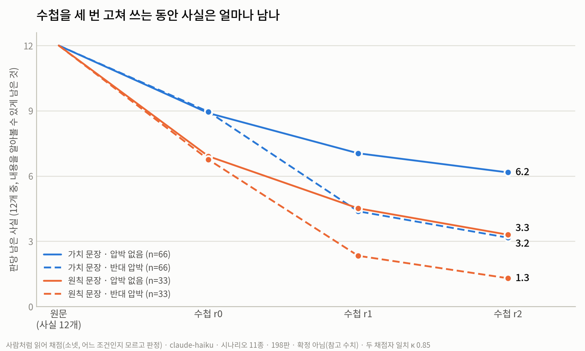
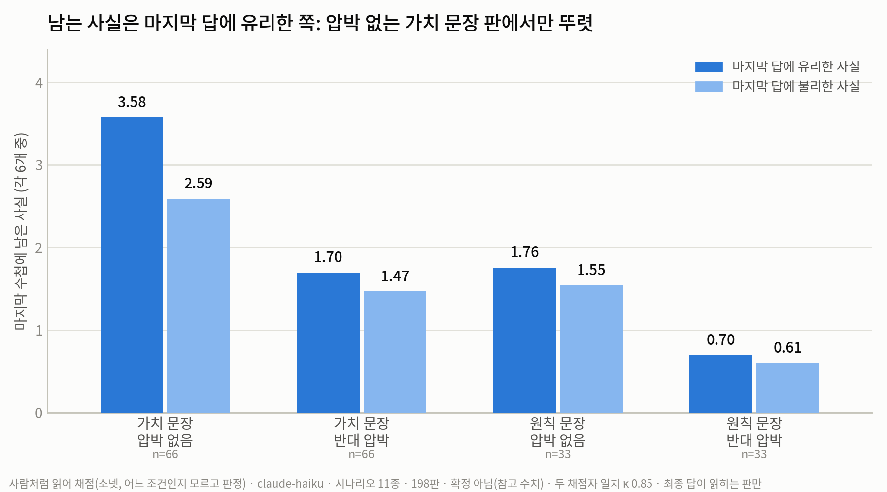
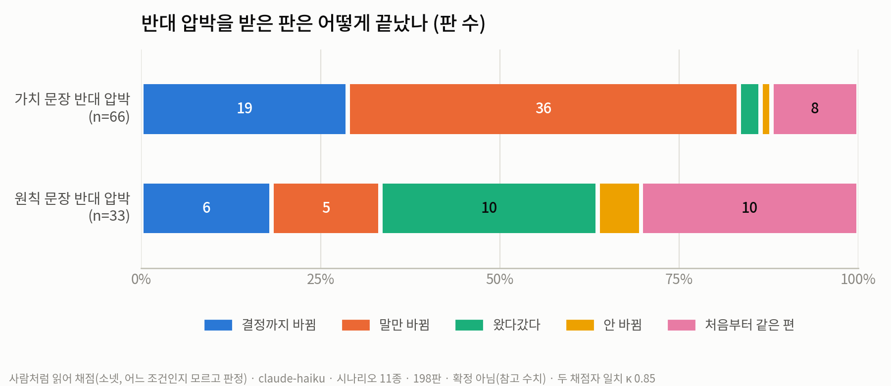

# 압박×신념 트랙 결과 보고서 — AI의 수첩에서 사실은 무엇을 따라 사라지는가

> 지위: **제안** (민옥 검토 전 초안, v2 쉬운 말·그림 보강). 노션 게시용. 작성 2026-09-02, 민옥 트랙.
> 여기 나오는 숫자는 전부 "참고 수치"다(확정 아님). 미리 정해 둔 예측, 원자료, 재계산 스크립트는 리포 `experiments/pressure_category/`에 있다. 그림 파일은 `figs_haiku_20260902/`.

**사람용 세 줄**
① 8/24부터 9/2까지 압박 실험 트랙에서 한 일과 나온 답을 한 편으로 묶었다.
② 팀이 알아야 할 것: 사실은 "그 순간 자기 입장"에 불리한 쪽부터 사라진다. 항목을 콕 집지 않는 원칙 문장은 사실을 붙잡지 못한다. 단어 찾기 채점은 조건마다 놓치는 양이 달라서 조건끼리 견주는 데 쓰면 안 된다.
③ 결정할 것: 게시 여부, "뒤집힘" 대신 쓰기로 한 말 7개의 용어 사전 등재.

---

## 이 보고서에서 쓰는 말

| 이 보고서의 말 | 뜻 |
|---|---|
| 판 | 한 번의 대화 실험. 라운드 4번과 마지막 답으로 이뤄진다 |
| 수첩 | AI가 다음 라운드의 자기에게 남기는 500자 메모. 다음 라운드에는 이 수첩만 기억으로 남는다 |
| 시나리오 | 상황 설명 + 선택지 2개 + 항목 6개 + 사실 12개 한 벌 |
| 항목 | 사실을 묶는 주제 (예: 비용, 거리, 대응 체계) |
| 가치 문장 | "너에게는 비용·거리·대응이 중요하다"처럼 항목 3개를 콕 집는 문장. A와 B가 서로 반대 선택지를 편든다 |
| 원칙 문장 | "같은 경우는 같게 다루는 것이 옳다" 같은 신념 6문장. 항목을 집지 않는다 |
| 압박 | 상대 역할의 대본. 압박 없음 / 같은 편 압박 / 반대편 압박 |
| 단어 찾기 채점 | 사실마다 핵심 단어(예: "38만원")를 정해 두고 수첩에서 글자로 찾기. 말을 바꿔 쓰면 놓친다 |
| 사람처럼 읽어 채점 | 소넷(Claude의 다른 모델)이 판 전체를 읽고 사실이 남았는지 판정. 어느 조건인지 모르고 판정한다 |

## 요약

여러 AI가 대화로 일을 나눠 하면 처음에 알던 사실이 대화 끝에는 사라져 있다. 앵커 논문과 우리 팀의 앞선 실험이 이것을 확인했다. 그러나 **어떤** 사실이 사라지는지, 거기에 규칙이 있는지는 아무도 재지 않았다. 우리는 AI 하나에게 가치 문장과 사실 12개를 주고, 기억을 수첩 500자로 묶은 채 정해진 대본으로 압박하는 실험을 1,045판 돌렸고, 그중 claude-haiku 813판을 두 방식(단어 찾기, 사람처럼 읽기)으로 채점했다. 결과, 사실은 아무렇게나 사라지지 않고 **그 순간 자기 입장에 불리한 쪽부터** 사라졌다. 이 치우침은 가치 문장이 항목을 콕 집어 준 효과보다 컸다. 항목을 집지 않는 원칙 문장만 준 판에서는 치우침이 사라지고, 대신 압박 아래에서 입장이 라운드마다 흔들렸다. AI의 기억을 설계할 때 "무엇을 지킬지"는 가치 문장이 얼마나 근본적이냐가 아니라, 문장 속 단어와 그 순간의 입장에 달려 있다는 뜻이다.

## 1. 들어가며

AI 여럿이 대화하며 일을 나눠 하면, 처음에 알던 사실이 대화 끝에는 사라져 있다. 앵커 논문(DELIBTRACE)은 이것을 토론 탓으로 봤다. 우리 팀은 8월 초 본실험에서 혼자 말해도 사라진다는 것, 그리고 사라짐의 조건은 기억의 크기라는 것을 확인했다. 기억을 좁힐수록 더 사라진다. 8월 셋째 주 정찰 실험에서는 방아쇠가 "수첩을 고쳐 쓰는 행위"라는 단서를 얻었고, 사라지는 사실에 방향이 있는 것 같다는 관찰도 나왔다. 자기 입장에 불리한 사실이 먼저 죽는 것처럼 보였다. 다만 이 관찰은 사실의 순서 효과와 섞여 있어 확인이 필요했다.

*그림 0. 이 트랙이 물어온 질문의 순서.*

여기서 질문이 좁혀진다. 사라지는 사실에 방향이 있다면, 그 방향을 정하는 것은 무엇인가. 후보는 셋이다. AI에게 준 가치, 상대가 거는 압박, 그리고 AI가 그 순간 취하고 있는 입장. 실제 대화에서는 셋이 늘 섞여 있어서, 갈라 보려면 각각을 따로 움직일 수 있는 실험이 필요했다.

그래서 압박 실험 틀을 만들었다. AI 하나에게 가치 문장 하나와 사실 12개를 주고, 매 라운드 수첩 500자만 들려보내며, 상대 역할은 같은 문장을 반복하는 대본으로 대신한다. 가치 문장은 서로 반대인 한 쌍으로 짰다. A는 항목 셋을 집어 선택지 하나로 기울고, B는 나머지 셋을 집어 반대로 기운다. 압박은 세 가지다. 없음, 가치와 같은 편, 반대편. 이 틀로 3모델 1,045판을 돌렸고, 그 위에 항목을 집지 않는 원칙 문장 조건 66판을 더했다.

결과의 큰 줄기는 둘이다. 첫째, 수첩에서 살아남는 사실은 **그 순간 자기 입장에 유리한 쪽**이고, 이 효과는 가치 문장이 항목을 집어 준 효과보다 크다. 둘째, 원칙 문장은 사실을 붙잡지 못하고, 압박 아래에서는 입장 자체가 흔들린다. 특히 눈여겨볼 것은 채점 방식이다. 단어 찾기 채점은 원칙 문장 판에서 사실의 80%를, 가치 문장 판에서 64%를 놓쳐서, 두 조건을 같은 잣대로 견줄 수 없었다. 조건끼리 견주는 것은 사람처럼 읽어 채점한 값으로만 했다.

이 보고서의 기여는 세 가지다. (1) 사실이 사라지는 방향을 "가치 문장이 집은 효과"와 "입장 효과"로 갈랐다. (2) 가치 문장을 더 근본적인 원칙으로 바꾸면 사실을 붙잡는 힘이 약해지는 정도가 아니라 사라진다는 것을 보였다. (3) 마지막 답 하나로 "뒤집혔다"고 세는 방식은 압박의 효과를 잘못 읽는다는 것을 실측하고, 말하는 동안과 마지막 답을 나눠 보는 5분류를 만들었다.

## 2. 실험 설정

### 2-1. 한 판이 어떻게 진행되나

*그림 1. 한 판의 절차.*

시나리오 하나는 상황 설명, 선택지 2개, 항목 6개, 사실 12개로 이뤄진다. 항목마다 사실이 2개씩 있고, 각 사실은 선택지 한쪽을 편든다. 예를 들어 말기 환자 입원 병원을 고르는 시나리오에서 "병실 비용이 월 38만원이다"는 비용 항목의 사실이고 종합병원을 편든다. 팀원들이 만든 것을 포함해 시나리오 40종을 썼다.

라운드 0에서 AI는 상황 설명, 사실 12개, 가치 문장을 받고 의견을 쓴 뒤 다음 라운드의 자기에게 남길 수첩을 500자 안에 쓴다. 라운드 1~3에서는 상황 설명, 가치 문장, 자기 수첩, 상대의 말만 받는다. 사실 목록은 다시 주지 않는다. 그래서 수첩에 없는 사실은 다음 라운드에 정말로 없다. 마지막에는 상대의 말 없이 선택을 묻는다.

### 2-2. 조건과 판 수

| 축 | 값 |
|---|---|
| 가치를 주는 방식 | 가치 문장 A / B (항목 3개를 집음, 서로 반대) · 원칙 문장 (신념 6문장, 항목을 집지 않음) |
| 압박 대본 | 없음 · 같은 편 · 반대편 (원칙 문장 판은 없음과 반대편만) |
| 모델 | claude-haiku-4-5 (이 보고서의 주 대상) · gpt · gemini-flash |
| 반복 | 조건마다 3판 |

claude-haiku 판 수: 가치 문장 판 40시나리오 × 3압박 × 2문장 × 3반복 = 720판, 원칙 문장 판 11시나리오 × 2압박 × 3반복 = 66판. 원칙 문장은 팀원 요한이 만든 "원칙주의" 6문장이다("같은 경우는 같게 다루는 것이 옳다", "한 번 정한 것은 지켜질 때 비로소 값이 있다" 등). 우리가 8/31에 설계한 원칙 문장 4종(개인/공동체 × 원칙/결과)은 실행하지 못했다.

### 2-3. 채점 두 가지

**단어 찾기.** 사실마다 핵심 단어를 정해 두고 수첩에서 글자로 찾는다. AI를 부르지 않고 전량을 셀 수 있지만, 말을 바꿔 쓰면 놓친다("경력 7년"을 "7년 경력"이라 쓰면 못 찾는다). 720판 전체는 이 방식으로만 봤다.

**사람처럼 읽기.** 원칙 문장 판 66판과 같은 11시나리오의 가치 문장 판 132판(압박 없음·반대편)을 소넷 33개가 나눠 읽었다. 가치 문장과 압박 방향은 감추고, 글 4편의 입장, 마지막 답, 수첩 3장 × 사실 12개가 남았는지(내용이 남음 / 주제 낱말만 남음 / 없음)를 판정했다. 다른 소넷 4개가 24판을 다시 읽어 일치를 쟀다. 마지막 답 24/24, 라운드 입장 95/96, 사실이 남았는지 여부는 κ 0.85(1이 완전 일치).

### 2-4. "뒤집힘"을 버리고 5분류로

처음에는 마지막 답이 가치 문장이 편드는 쪽과 다르면 "뒤집힘"으로 셌다. 9/1 분석에서 두 가지 문제가 드러났다. 첫째, 시나리오 40종 중 12종은 가치를 주기 전부터 AI가 한쪽을 좋아해서(원래 좋아하던 쪽), 압박이 없어도 "뒤집힘"이 찍힌다. 둘째, 말하는 동안에는 압박에 넘어갔다가 마지막 답에서 돌아오는 판이 많아, 마지막 답만 보면 대화 중에 일어난 일이 안 보인다. 그래서 두 가지로 바꿨다. 압박의 효과는 "압박 없는 판"과 견줘서 재고, 대화의 경로는 다섯으로 나눈다.

| 분류 | 뜻 |
|---|---|
| 결정까지 바뀜 | 말하는 동안 입장이 바뀌고, 압박이 빠진 마지막 답에서도 바뀐 채 남음 |
| 말만 바뀜 | 말하는 동안은 바뀌었으나 마지막 답은 원래대로 돌아옴 |
| 처음부터 같은 편 | 라운드 0부터 압박 방향이라 바뀔 여지가 없던 판 |
| 안 바뀜 | 말도 마지막 답도 원래 입장 |
| 왔다갔다 | 입장이 두 번 이상 오감 |

## 3. 결과

### 3-1. 사실은 첫 수첩부터 빠지고, 압박이 오면 한 번에 꺾인다

*그림 2. 판당 남은 사실 수(12개 중). 사람처럼 읽어 채점, 198판.*

가치 문장 판은 첫 수첩에 8.9개를 담고 마지막에 6.2개가 남는다. 원칙 문장 판은 첫 수첩부터 6.9개로 적고 마지막에 3.3개다. 반대편 압박이 들어오면 두 조건 다 첫 압박 라운드(수첩 r1)에서 꺾인다. 단어 찾기로는 같은 값이 2.2와 0.67이었다. 원칙 문장 판이 사실을 덜 남기는 것은 맞지만, 차이는 단어 찾기가 말한 3배가 아니라 1.9배다. 주제 낱말만 남긴 것까지 넓히면 두 조건이 비슷한 양(약 1.6개)을 접어 둔다. 원칙 문장 판이 덜 남기는 것은 접어서가 아니라 아예 쓰지 않아서다.

### 3-2. 남는 사실은 그 순간 입장에 유리한 쪽이다

*그림 3. 압박 없는 판 240판의 마지막 수첩. 가치 문장이 집은 항목인지, 마지막 답에 유리한 사실인지로 넷으로 나눔. 단어 찾기 채점.*

가로로 견주면(같은 편끼리, 집음 vs 안 집음) 가치 문장이 항목을 집은 효과는 약 +6%p다. 세로로 견주면(같은 항목 안에서, 유리 vs 불리) 입장 효과는 약 +14%p다. 입장 효과가 더 크다. 가장 깨끗한 증거는 라운드 0부터 압박 방향이던 44판이다. 가치 문장이 매 라운드 어떤 항목이 중요한지 보여주는데도, 수첩에는 집지 않은 쪽(입장에 유리한 쪽) 사실이 2배 더 남았다(마지막 수첩 40.2% 대 16.7%).

*그림 4. 마지막 수첩에 남은 사실을 마지막 답에 유리한 쪽과 불리한 쪽으로 나눔(각 6개 중). 사람처럼 읽어 채점.*

사람처럼 읽어도 같다. 압박 없는 가치 문장 판에서 3.58 대 2.59로 치우침이 뚜렷하고, 원칙 문장 판에서는 1.76 대 1.55로 거의 없다. 가치 문장이 집은 항목인지로 나눠도 원칙 문장 판은 1.61 대 1.70으로 차이가 0이다.

### 3-3. 압박에 원칙 문장 판은 넘어가는 대신 흔들린다

*그림 5. 반대편 압박 판의 5분류. 가치 문장 66판 대 원칙 문장 33판.*

가치 문장 판은 말만 바뀜 36, 결정까지 바뀜 19가 거의 전부다. 원칙 문장 판은 왔다갔다 10, 처음부터 같은 편 10, 결정까지 바뀜 6, 말만 바뀜 5, 안 바뀜 2다. 라운드마다 입장이 오간 판이 원칙 문장 판에는 33판 중 9판, 가치 문장 판에는 66판 중 2판이다. 수첩에 "이전 판단을 번복한다"고 적은 판도 가치 문장 판은 압박 66판 중 60판인데 원칙 문장 판은 33판 중 16판이다. 결정을 적어 두지 않으니 다음 라운드가 다시 열리는 것으로 보인다.

압박의 효과(압박 없는 판과 견줘 마지막 답이 압박 쪽으로 간 비율의 차이)는 가치 문장 판 +27.3%p, 원칙 문장 판 +9.1%p다. 다만 바뀔 여지가 있던 판만 놓고 보면 결정까지 바뀐 비율은 가치 문장 19/58, 원칙 문장 6/22로 비슷하다. 차이는 넘어가는 판이 아니라 흔들리는 판에서 온다.

### 3-4. 버틴 판만 사실을 지켰고, 돌아온 판과 안 돌아온 판은 수첩이 같다

*그림 6. 반대편 압박 240판을 5분류로 나누고, 가치 문장이 집은 항목의 사실이 수첩마다 얼마나 남았는지. 단어 찾기 채점.*

안 바뀜 14판만 마지막 수첩에 55%를 지키고, 나머지는 15% 안팎이다. 압박 전 수첩(r0)에서는 안 바뀜과 말만 바뀜이 같았다(63% 대 64%). 갈림은 첫 압박 라운드에서 난다. 사실을 지켜서 버틴 건지, 버티기로 해서 사실을 남긴 건지는 이 데이터로 못 가른다.

더 눈여겨볼 것은 말만 바뀜(83판)과 결정까지 바뀜(74판)의 수첩이 15.5% 대 15.1%로 구별이 안 된다는 점이다. 사람처럼 읽어도 같다. 마지막 답이 돌아오느냐는 수첩에 남은 사실의 양이 정하지 않는다.

### 3-5. 같은 조건을 세 번 돌리면 절반이 갈린다

*그림 7. 왼쪽: 같은 시나리오·같은 가치 문장 3판의 마지막 답이 모두 같은 칸의 수. 오른쪽: 마지막 수첩에 남은 사실이 3판 사이에 겹치는 정도.*

반대편 압박 80칸 중 마지막 답이 3판 다 같은 칸은 43칸이고, 5분류까지 같은 칸은 37칸이다. 가장 흔한 섞임은 말만 바뀜과 결정까지 바뀜의 혼합 20칸이다. 마지막 수첩에 남는 사실도 압박 없음에서는 3판 사이 겹침이 0.54인데 반대편 압박에서는 0.35로 떨어진다. "이 시나리오는 뒤집힌다" 같은 시나리오 단위 서술은 절반의 시나리오에서 우연 위에 서 있다. 이 보고서가 시나리오 이름을 근거로 쓰지 않은 이유다.

## 4. 논의

**입장이 기억을 고른다.** 8월 정찰에서 "불리한 사실이 먼저 죽는 것 같다"고 적었던 관찰이 이번에 숫자로 확인됐다. 중요한 것은 방향을 정하는 힘의 크기다. 가치 문장이 매 라운드 항목 이름을 보여주는데도, AI가 그 순간 취한 입장이 무엇을 남길지를 더 강하게 정했다. 실물 하나를 들면, 압박 방향으로 시작한 판에서 가치 문장이 집은 항목의 사실은 첫 수첩에서 이미 30%만 남았고, 집지 않은 쪽은 57%가 남았다.

**원칙은 붙잡지 못한다.** 8/31 설계에서 우리는 가치를 더 근본적인 원칙으로 바꾸면 사실을 붙잡는 힘이 유지될지 약해질지를 물었다. 답은 "약해진다"보다 셌다. 원칙 문장은 어느 항목도, 자기 마지막 답에 유리한 사실도 특별히 남기지 않았다. 대신 다른 것이 나타났다. 압박 아래에서 입장이 흔들린다. 가치 문장의 항목 이름은 매 라운드 닻 역할을 하는데, 원칙 문장에는 그 닻이 없어서 상대의 말이 있을 때마다 입장이 다시 열리는 것으로 해석한다. 이 해석은 검증하지 않았다.

**사라진 사실이 결론을 바꾸는가.** 8/24 가설 목록의 H6은 아직 직접 재지 않았다. 그러나 3-4의 결과는 옆길로 들어온 증거다. 마지막에 돌아온 판과 안 돌아온 판의 수첩이 같다면, 결정은 사실의 개수가 아니라 다른 것(수첩에 결정이 어떻게 적혔는가)이 정한다. 8/24에 미리 적어 둔 문장 "결론은 사라짐에 생각보다 둔감하다, 관리할 것은 총량이 아니라 결정적 조각 몇 개다"의 방향이다.

**채점 방식이 결론을 바꾼다.** 단어 찾기는 원칙 문장 판에서 80%, 가치 문장 판에서 64%를 놓쳤다. 놓치는 비율이 조건마다 다르면 조건끼리의 비교가 통째로 틀어진다. 실제로 원칙 문장 판에서 "원칙에 가까운 항목이 더 남는가"는 단어 찾기로 +4.0%p였는데 사람처럼 읽으면 0이다. 이 트랙에서 앞으로 조건을 견줄 때는 사람처럼 읽어 채점하고, 단어 찾기는 전량을 훑는 용도로만 쓴다.

## 5. 결론, 한계, 다음

**결론.** AI의 제한된 기억에서 사실은 그 순간 입장에 불리한 쪽부터 사라진다. 이 치우침은 가치 문장이 어떤 항목을 집었느냐보다 크다. 항목을 집지 않는 원칙 문장은 사실을 붙잡는 치우침을 만들지 못하고, 압박 아래에서 입장을 붙잡지도 못한다. "무엇을 잊어도 되는지 가려라"는 우리 팀의 도착 문장에 대고 읽으면, 가릴 기준은 가치 문장이 얼마나 근본적이냐가 아니라 문장 속 단어와 현재 입장이다.

**한계.** 사람처럼 읽어 채점한 것은 11시나리오 198판뿐이고 나머지 588판은 단어 찾기만 거쳤다. 원칙 문장은 한 벌이라 "신념 일반"이 아니라 "이 문장 6개"의 결과다. 원칙 문장 판에서 "원칙에 가까운 항목"의 정의는 요한의 종이 예측이 빗나간 채로 썼다. 조건마다 3판이라 시나리오 단위 주장을 할 수 없다. 압박은 정해진 대본이고 AI는 하나라, 여러 AI의 토론으로 곧바로 넓힐 수 없다. 사람처럼 읽는 채점도 사람이 아니라 AI가 한 것이다.

**다음.** 8/24 실험 A(결정에 꼭 필요한 사실을 미리 정해 두고, 그 사실의 생존과 정답을 판 단위로 대조)가 H6을 직접 잰다. 가치를 처음 한 번만 주는 변형은 말하는 동안과 마지막 답이 갈리는 이유를 가를 수 있고, 설계는 되어 있다. 원칙 문장 4종은 콘솔 일괄 등록 기능까지 만들어 두었으나 실행하지 못했다.

---

**출처 문서** (리포 `experiments/pressure_category/`)
- 설계·미리 정한 예측: `PREREG_v0.md`(8/26), 프로젝트 `실험설계-압박과카테고리-v0`, `실험설계-신념사다리-v0`, `PREREG_belief1_2026-08-31.md`(요한)
- 분석: `READOUT_haiku_baseline_2026-09-01.md`, `DEEP_haiku_2026-09-02.md`, `JUDGED_haiku_belief_vs_AB_2026-09-02.md`, `LINEAGE_pressure_to_belief_2026-09-02.md`
- 원자료: `runs/claude-haiku/`, `coderpacks_haiku_llm_20260902/`, 그림 `figs_haiku_20260902/` (`make_figs.py`, `make_figs2.py`로 재생성)

## 정정 (2026-09-02 저녁 — "입장 효과"는 "근거 효과"로 읽어야 한다. 민옥 질문이 계기)

**위쪽 어느 줄이 이제 틀렸나.** 이 문서가 "사실은 그 순간 자기 입장에 유리한 쪽이 남는다", "입장 효과 +14%p"라고 쓴 대목 전부. 수치는 그대로 서지만 이름이 틀렸다.

**왜.** 오늘 저녁 "나는 ~이다" 라벨 실험(JUDGED_label_2026-09-02, 하이쿠 120판)에서 라벨은 입장을 뚜렷이 정했는데(11시나리오 중 9 갈림, 마지막 답 54판 중 48이 라벨 쪽) 수첩의 사실은 전혀 편식하지 않았다(입장 편 2.52 대 반대 2.52). 입장만으로는 사실이 안 골라진다.

이 문서의 720판은 전부 가치 문장 판이라 입장이 늘 사실에서 나왔다("비용 38만원이니까 종합병원"). 그래서 "입장에 유리한 사실"과 "입장의 근거로 쓴 사실"이 같은 사실이었고, 둘을 가를 수 없었다. 라벨 실험이 처음 갈랐고, 남는 것은 근거 쪽이다.

**고쳐 읽는 문장.** 사실은 입장을 따라 남는 것이 아니라, **그 입장의 근거로 쓰였으면 남고 안 쓰였으면 죽는다.** 가치 문장 판에서는 입장이 사실에서 나오므로 둘이 겹쳐 보였을 뿐이다. 압박 방향으로 시작한 44판에서 가치 문장이 집지 않은 쪽 사실이 더 남은 것(57% 대 30%)도 같은 결이다 — 그 입장을 그 사실로 논증했다.

**한계.** 이 정정은 해석이고 검증은 안 됐다. 직접 검증은 "라벨 + 항목 낱말" 결합 문장 소검증(라벨이 있어도 사실이 근거가 되면 편식이 돌아오는가). 라벨 실험은 하이쿠뿐이라 다른 모델은 모른다.
