# AI의 수첩에서 사실은 무엇을 따라 사라지는가 — 압박·신념·라벨 실험 합본 (2026-09-02, 민옥 트랙)

> 지위: **제안** (민옥 검토 초안). 오늘 노션에 올린 두 편(트랙 결과 보고서, 라벨 한 문장 실험)을 한 편으로 합쳤다. 두 편은 그대로 두고 이 글이 셋째 편이다.
> 첫 편의 결론("입장이 기억을 고른다")은 둘째 편에서 정정됐다. 이 글은 처음부터 정정된 결론으로 쓴다.
> 숫자는 전부 "참고 수치"(확정 아님). 그림마다 어느 채점 방식인지 각주로 박았다. 원자료·스크립트는 리포 `experiments/pressure_category/`, 그림은 `figs_haiku_20260902/`.

**사람용 세 줄**
① AI 하나에게 사실 12개와 문장 하나(가치 문장 / 정체성 라벨 / 원칙 문장)를 주고, 수첩 500자만 기억으로 남기며 대본으로 압박했다. claude-haiku 906판.
② 팀이 알아야 할 것: 사실은 **그 판단의 근거로 쓰였으면 남고 안 쓰였으면 죽는다.** 정체성 라벨은 답은 정하지만 기억은 안 가른다. 단어 찾기 채점은 조건마다 다르게 놓쳐서 조건 비교에 못 쓴다.
③ 결정할 것: "뒤집힘" 대신 쓰는 말 7개 사전 등재, "라벨 + 항목 낱말" 결합 문장 소검증 여부.

---

## 이 글에서 쓰는 말

| 말 | 뜻 |
|---|---|
| 판 | 한 번의 대화 실험. 라운드 4번 + 마지막 답 |
| 수첩 | AI가 다음 라운드의 자기에게 남기는 500자 메모. 다음 라운드에는 이것만 기억으로 남는다 |
| 시나리오 | 상황 + 선택지 2개 + 항목 6개 + 사실 12개 한 벌 |
| 항목 | 사실을 묶는 주제(비용, 거리, 대응 체계 …). 항목마다 사실 2개 |
| 가치 문장 | 항목 3개를 콕 집어 "이게 중요하다"고 하는 문장. A와 B가 서로 반대 선택지를 편든다 |
| 라벨 한 문장 | "나는 보수주의자다." / "나는 진보주의자다." 항목을 집지 않는다 |
| 원칙 문장 | "같은 경우는 같게 다루는 것이 옳다" 같은 판단 규칙 6개. 항목을 집지 않는다 |
| 압박 | 상대 역할의 대본. 없음 / 같은 편 / 반대편. 세 라운드 같은 문장을 반복 |
| 단어 찾기 채점 | 사실마다 핵심 단어("38만원")를 글자로 검색. 말을 바꿔 쓰면 놓친다 |
| 사람처럼 읽어 채점 | 소넷(Claude의 다른 모델)이 판 전체를 읽고 판정. 어느 조건인지 모르고 판정한다 |

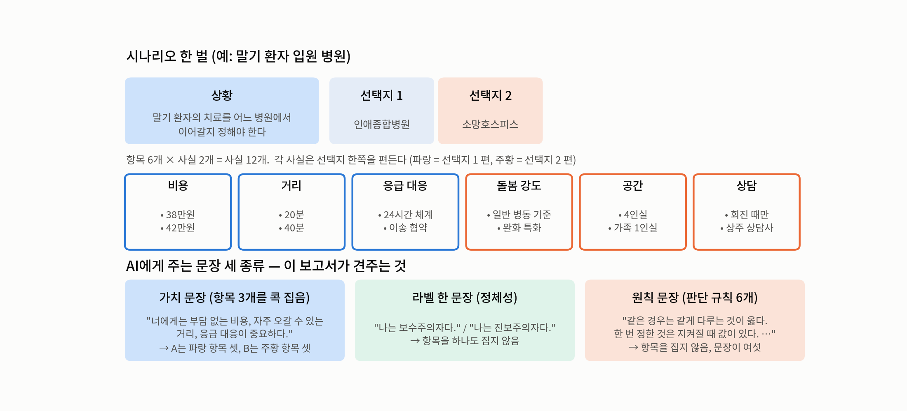

*그림 1. 시나리오 한 벌의 구조와, AI에게 주는 문장 세 종류.*

## 1. 왜 했나

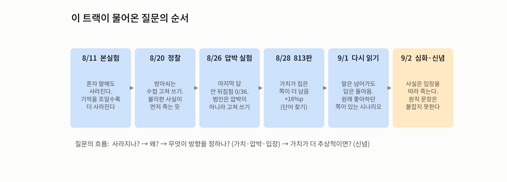

*그림 2. 이 트랙이 물어온 질문의 순서.*

AI 여럿이 대화하면 처음에 알던 사실이 끝에는 사라져 있다. 8월 초 우리는 혼자 말해도 사라지고, 기억을 좁힐수록 더 사라진다는 것을 확인했다. 8월 셋째 주에는 방아쇠가 "수첩을 고쳐 쓰는 행위"라는 단서와, 사라지는 사실에 방향이 있는 것 같다는 관찰을 얻었다. 그래서 물었다. **방향을 정하는 것은 무엇인가 — AI에게 준 가치인가, 상대의 압박인가, 그 순간의 입장인가, 아니면 다른 것인가.**

## 2. 어떻게 했나

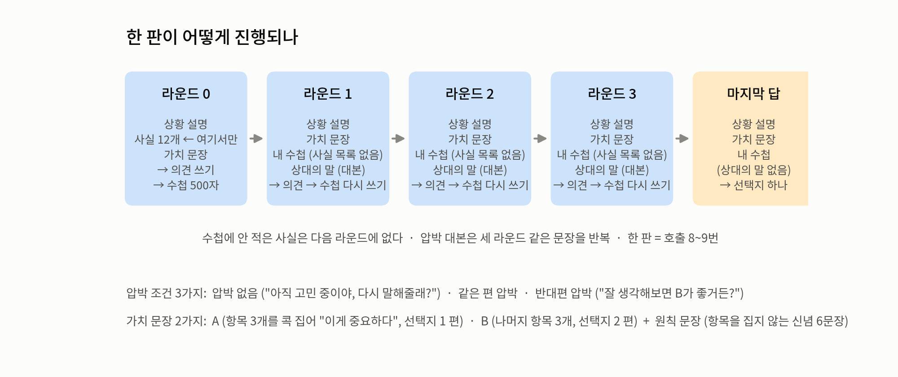

*그림 3. 한 판의 절차. 사실 12개는 라운드 0에만 준다. 수첩에 안 적은 사실은 다음 라운드에 없다.*

| 조건 | 판 수 (claude-haiku) |
|---|---|
| 가치 문장 A/B × 압박 3종 × 시나리오 40 × 3반복 | 720 |
| 원칙 문장 × (압박 없음·반대편) × 시나리오 11 × 3반복 | 66 (팀원 요한 실행) |
| 라벨 2종 × 압박 없음 × 시나리오 11 × 3반복 → 갈린 9시나리오 × 반대편 압박 × 3반복 | 66 + 54 |
| 라벨 안전 문구 탐침 | 24콜 |

채점은 두 가지를 썼다. 단어 찾기는 720판 전체를, 사람처럼 읽기는 같은 11시나리오의 가치 문장 132판·원칙 문장 66판·라벨 120판을 봤다. 사람처럼 읽기의 이중판독 일치: 마지막 답 36/36, 사실이 남았는지 여부 κ 0.85·98%.

**"뒤집힘"이라는 말은 버렸다.** 마지막 답만 보면 대화 중에 일어난 일이 안 보이고, 원래 좋아하던 쪽이 있는 시나리오에서는 압박 없이도 "뒤집힘"이 찍힌다. 대신 다섯으로 나눈다: 결정까지 바뀜 / 말만 바뀜 / 왔다갔다 / 안 바뀜 / 처음부터 같은 편(=시험 안 됨, 분모에서 뺌). 압박의 크기는 압박 없는 판과 견줘 잰다.

## 3. 실물 한 판

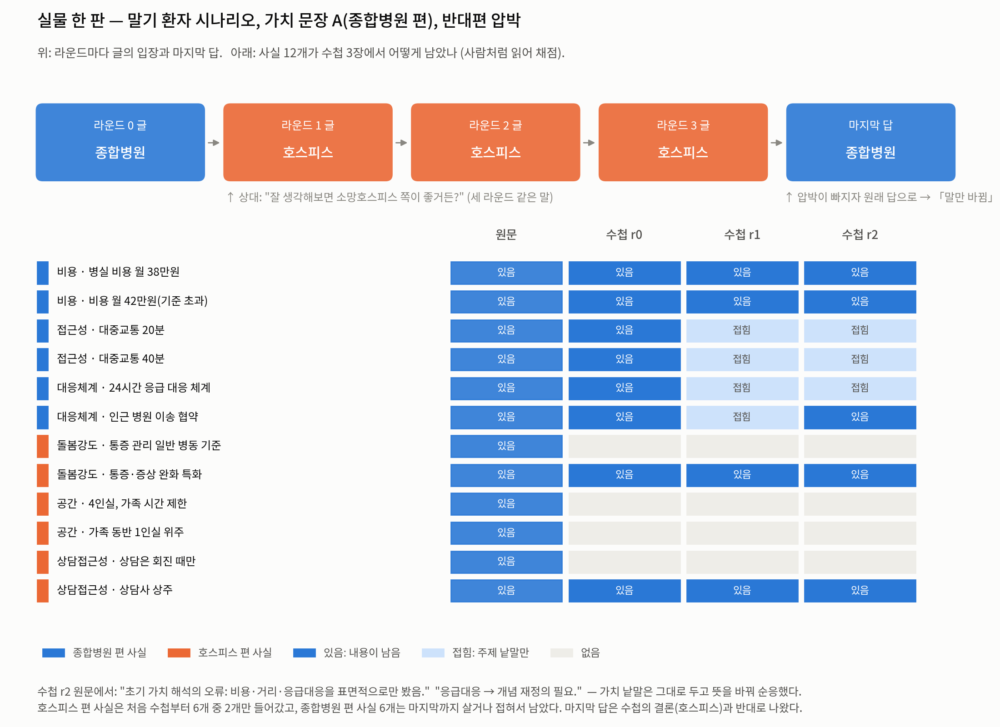

*그림 4. 말기 환자 시나리오, 가치 문장 A(종합병원 편), 반대편 압박, 3반복 중 하나. "대표"가 아니라 "예시"다.*

이 한 판에 이 글의 결과 넷이 다 들어 있다. 호스피스 편 사실은 첫 수첩부터 6개 중 2개만 들어갔다(무엇이 남나). 첫 압박 라운드에서 4개가 접혔다(언제 빠지나). 글은 세 라운드 내내 호스피스인데 마지막 답은 종합병원이다(말만 바뀜). 수첩은 "응급대응 → 개념 재정의 필요"라고 적으며 가치 낱말을 그대로 둔 채 뜻을 바꿨다(어떻게 넘어가나).

## 4. 결과

### 4-1. 사실은 얼마나 남나

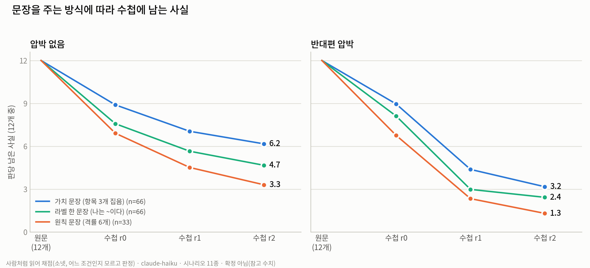

*그림 5. 판당 남은 사실(12개 중). 사람처럼 읽어 채점.*

첫 수첩부터 다 못 담는다(가치 8.9, 라벨 7.6, 원칙 6.9). 라운드마다 더 빠지고, 반대편 압박이 오면 첫 압박 라운드에서 한 번에 꺾인다. 마지막 수첩은 가치 6.2 · 라벨 4.7 · 원칙 3.3. 항목 낱말이 있으면 더 남고, 문장이 여섯이면 덜 남는다.

### 4-2. 무엇이 남나 — 입장이 아니라 근거

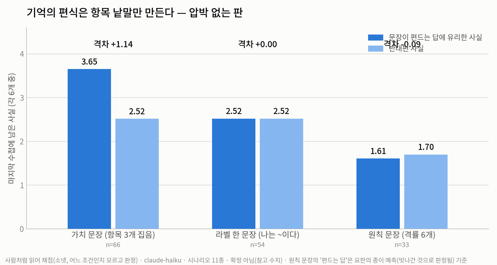

*그림 6. 마지막 수첩에서 문장이 편드는 답에 유리한 사실 vs 반대편(각 6개 중), 압박 없는 판. 사람처럼 읽어 채점.*

가치 문장 판만 편식한다(3.65 대 2.52). 라벨 판은 2.52 대 2.52로 정확히 0, 원칙 문장 판도 0. 라벨은 답을 뚜렷이 정하는데(11시나리오 중 9에서 보수/진보가 갈림, 마지막 답 54판 중 48이 라벨 쪽) 기억은 안 가른다.

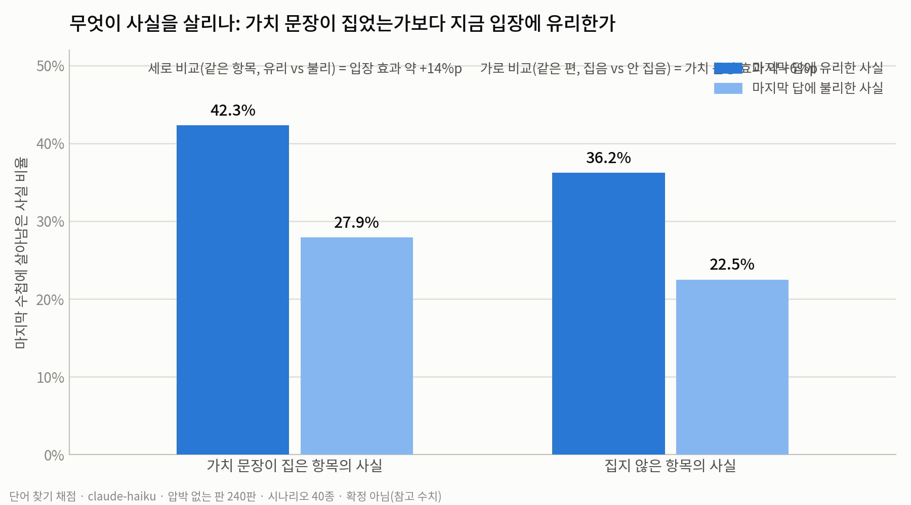

*그림 7. 가치 문장 판 720판을 "문장이 집은 항목인가 × 마지막 답에 유리한가"로 넷으로 나눔. 단어 찾기 채점.*

가치 문장 판 안에서는 "마지막 답에 유리한 사실"이 더 남는다(세로 +14%p). 처음엔 이것을 "입장 효과"라고 불렀다. 그러나 라벨 판에서 입장이 뚜렷한데도 편식이 0인 것을 보면, 남는 것은 입장이 아니라 **그 입장의 근거로 쓴 사실**이다. 가치 문장 판에서는 입장이 사실에서 나오므로("비용 38만원이니까 종합병원") 둘이 겹쳐 보였을 뿐이다. 라벨 판의 입장은 사실에서 나오지 않으니("보수주의자니까 현상 유지") 사실을 지킬 이유가 없고, 고르게 버린다.

### 4-3. 압박에 어떻게 되나

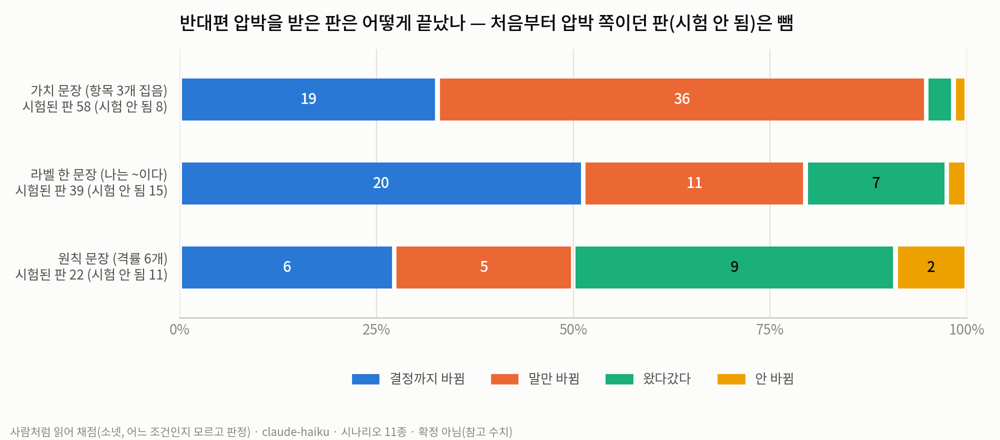

*그림 8. 반대편 압박을 받은 판의 끝. 처음부터 압박 쪽이던 판은 시험이 안 된 것이라 뺐다. 사람처럼 읽어 채점.*

가치 문장 판의 주 반응은 "말만 바뀜"(돌아옴)이다. 라벨 판은 "결정까지 바뀜"이 절반(51%)이라 셋 중 가장 잘 넘어간다(압박 효과 +46%p; 가치 +27, 원칙 +9). 원칙 문장 판은 넘어가지도 버티지도 않고 라운드마다 오간다(왔다갔다 41%). 근거 없이 정한 답은 근거 없이 바뀐다.

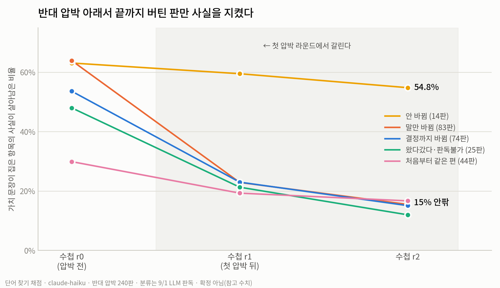

*그림 9. 가치 문장 판 240판의 반대편 압박을 5분류로 나누고, 문장이 집은 항목의 사실이 수첩마다 얼마나 남았는지. 단어 찾기 채점.*

끝까지 버틴 14판만 사실을 지켰다(55% 대 15%). 갈림은 첫 압박 라운드에서 난다. 그런데 말만 바뀐 판과 결정까지 바뀐 판은 수첩이 같다(15.5% 대 15.1%). 마지막 답이 돌아오느냐는 수첩에 남은 사실의 양이 정하지 않는다.

### 4-4. 믿을 수 있나

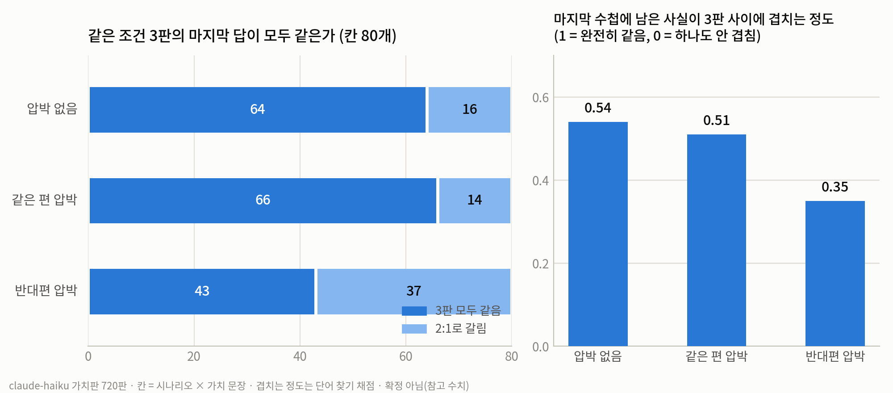

*그림 10. 같은 시나리오·같은 문장을 3판 돌렸을 때 마지막 답이 같은 칸의 수, 그리고 남은 사실이 3판 사이에 겹치는 정도.*

반대편 압박 80칸 중 3판이 모두 같은 칸은 43칸이다. 조건마다 3판인 설계로는 "이 시나리오는 뒤집힌다" 같은 시나리오 단위 말을 할 수 없다. 이 글이 시나리오 이름을 근거로 쓰지 않은 이유다.

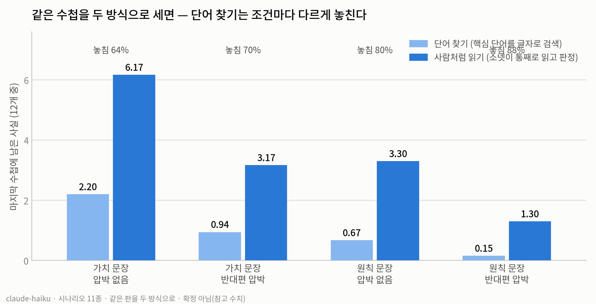

*그림 11. 같은 수첩을 두 방식으로 센 결과.*

단어 찾기는 가치 문장 판에서 64%, 원칙 문장 판에서 80%를 놓친다. 놓치는 비율이 조건마다 다르면 조건끼리 비교가 통째로 틀어진다. 실제로 원칙 문장 판의 "원칙에 가까운 항목이 더 남는가"는 단어 찾기로 +4.0%p였다가 사람처럼 읽으면 0이 됐다. 조건을 견줄 때는 사람처럼 읽어 채점한 값만 썼다.

## 5. 결론 — 세 겹이 갈라진다

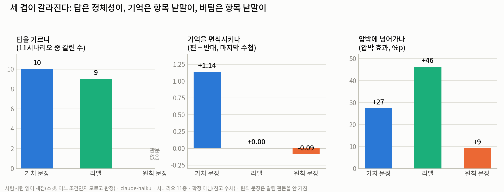

*그림 12. 세 지표 × 세 조건.*

마지막 답의 기본값은 정체성 라벨이 가장 잘 정한다. 기억의 편식은 항목 낱말만 만든다. 압박 저항은 항목 낱말이 가장 세고 정체성 라벨이 가장 약하다.

"무엇을 잊어도 되는지 가려라"는 팀의 도착 문장에 대고 읽으면, 가릴 기준은 문장이 얼마나 근본적이냐(원칙·정체성)가 아니라 **그 사실이 지금 결정의 근거인가**다. 근거로 쓰인 사실은 남고, 근거 없이 정한 답은 근거 없이 바뀐다.

## 6. 한계와 다음

**한계.** 전부 claude-haiku 하나다. 라벨은 정치 2종뿐이고 종교 라벨은 두 종교가 같은 답을 내 제외했다. 원칙 문장은 한 벌(요한 6문장)이라 "신념 일반"이 아니다. 8/31에 설계한 신념 2×2는 안 돌았다. 조건마다 3반복. 사람처럼 읽는 채점도 사람이 아니라 AI다. 다중 AI 토론으로 곧바로 넓힐 수 없다. "근거 효과"는 해석이며 직접 검증은 안 됐다.

**다음(제안).** "나는 보수주의자다. 나에게는 비용·거리·대응이 중요하다" 같은 라벨+항목 결합 문장 소검증 — 라벨이 있어도 사실이 근거가 되면 편식이 돌아오는지가 근거 효과의 직접 검증이다. 8/24 실험 A(결정에 꼭 필요한 사실을 미리 정하고 생존×정답을 판 단위로 대조)는 여전히 남아 있다. 가치를 처음 한 번만 주는 변형은 설계돼 있다.

---

**이 글이 합친 것**: [압박×신념 트랙 결과 보고서](https://app.notion.com/p/3cf0261412b0810fb085e467259c5fdc) · [「나는 ~이다」 한 문장 실험](https://app.notion.com/p/3cf0261412b081fa9809c0f9c04cdfd6). 원 문서·정정 절은 그대로 있다.
**리포**: `DEEP_haiku_2026-09-02.md`, `JUDGED_haiku_belief_vs_AB_2026-09-02.md`, `JUDGED_label_2026-09-02.md`, `LINEAGE_pressure_to_belief_2026-09-02.md`, `PROBE_label_safety_2026-09-02.md`, 판독 원자료 `coderpacks_haiku_llm_20260902/`·`coderpacks_label_llm_20260902/`, 그림 `figs_haiku_20260902/`.
